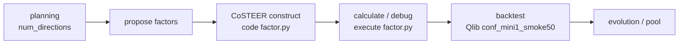

# 陈远恒 Workspace 迁移指南（QuantaAlpha × MAFS5140 mini1）

> **目标读者**：在新服务器上接手的 Agent / 开发者。  
> **场景**：在 **MAFS5140 mini1** 上用 **QuantaAlpha** 做因子挖掘（`train.parquet` + Qlib `mini1_us_5min` 回测），本机因内存不足（~32GB 且无 swap）易 OOM，流程已迁出 Ubuntu 旧机。

---

## 1. 目录结构

| 路径 | 角色 |
|------|------|
| `QuantaAlpha/` | 因子挖掘主仓库（Fork/补丁版，相对 upstream `QuantaAlpha/QuantaAlpha`） |
| `MAFS5140-Spring2026-Project/` | 课程项目：数据路径、`env.sh`、启停/监控脚本、`mini1_results/` |
| `MAFS5140-Spring2026-Project-ref/` | 课程交付骨架（`strategy.py` 等），最终因子需接入此处 |
| `/srv/quant/shared_data/users/<user>/` | **旧机运行时大数据**（workspace、pickle cache、quanta_results），**不要进 Git** |

建议新服务器统一根目录，例如 `/data/chenyuanhengWorkspace/`，并设置：

```bash
export CHY_WS=/data/chenyuanhengWorkspace   # 按实际修改
```

---

## 2. 新服务器前置条件

### 2.1 硬件与系统

| 项 | 建议 |
|----|------|
| **内存** | **≥ 32GB**（单因子 full `train.parquet` 计算峰值约 **20GB RSS**） |
| **Swap** | 建议 **16GB+**，避免无 swap 时直接被 OOM killer 杀进程 |
| **CPU** | 6 核即可（脚本已 `taskset` + 限制 BLAS 线程） |
| **磁盘** | `train.parquet` ~500MB；Qlib `mini1_us_5min` ~4GB；每个因子 workspace 的 `result.h5` ~1GB |

### 2.2 Python 环境

- Conda 环境名：**`quantsociety_backend`**
- 可执行：`quantaalpha mine`（与 `FACTOR_CoSTEER_PYTHON_BIN` 同一 Python）
- 安装 QuantaAlpha 依赖（按 upstream README / `requirements`）

### 2.3 必须从旧机拷贝、不进 Git 的数据

```bash
# 训练面板（因子 calculate 唯一数据源）
$CHY_WS/MAFS5140-Spring2026-Project/mini1/train.parquet
$CHY_WS/MAFS5140-Spring2026-Project/mini1/validation.parquet   # 可选

# Qlib 本地数据（回测）
$CHY_WS/QuantaAlpha/data/qlib/mini1_us_5min/

# 若需 instruments 列表（已在仓库小文件里）
# QuantaAlpha/data/qlib/mini1_us_5min/instruments/mini1_smoke50.txt
```

可用 `rsync -avP` 从旧 Ubuntu 同步。旧机共享盘（**勿提交 Git**）：

- `rdagent_workspace/` — 各因子 CoSTEER workspace（含 `result.h5`）
- `quanta_results/` — pickle cache、实验输出

---

## 3. 环境变量与密钥

### 3.1 `MAFS5140-Spring2026-Project/scripts/env.sh`

启动前 **必须** `source`（路径请按 `CHY_WS` 修改脚本内常量或导出 `CHY_WS` 后改脚本）：

| 变量 | 含义 |
|------|------|
| `QUANTA_BIN_DIR` | `quantsociety_backend` 的 `bin` |
| `QUANTA_SHARED_DATA` | 共享数据根（workspace、results） |
| `WORKSPACE_PATH` | 因子 workspace 根，默认 `$QUANTA_SHARED_DATA/rdagent_workspace/RD-Agent_workspace` |
| `DATA_RESULTS_DIR` | 实验结果 / pickle cache 根 |
| `QLIB_DATA_DIR` | Qlib 数据目录 |
| `QA_QLIB_CONF` | 默认 `conf_mini1_smoke50.yaml` |
| `MINI1_TRAIN_PARQUET` | `train.parquet` 绝对路径 |
| `PYTHONPATH` | 包含 `QuantaAlpha` 仓库根 |
| `CACHE_WITH_PICKLE` | 建议 **`false`**（减内存、减隐式缓存） |

### 3.2 `QuantaAlpha/.env`（勿提交 Git）

从 `.env.example` 复制并填写 LLM API。运行脚本会覆盖：

```bash
export QA_DISABLE_COSTEER_RAG=true      # 禁用 RAG/embedding（Spanagent 不支持 text-embedding-3-small）
export CHAT_MODEL=deepseek-v3.2
export REASONING_MODEL=deepseek-v3.2
```

### 3.3 内存相关建议

```bash
export QA_DISABLE_COSTEER_RAG=true
export CACHE_WITH_PICKLE=false
export MULTI_PROC_N=1
export OMP_NUM_THREADS=6
export MKL_NUM_THREADS=6
```

---

## 4. 端到端 Pipeline（Agent 速览）



1. **Planning**：`configs/experiment_stage5_original_clean.yaml` → 4 个方向；`..._d0.yaml` → **仅 D0（1 方向）** 用于冒烟/省内存。  
2. **Propose**：每假设若干因子表达式。  
3. **Construct**：CoSTEER 写 `factor.py`（Jinja 模板 + `compute_factor_from_train`）。  
4. **Calculate**：`FactorFBWorkspace.execute()` 子进程跑 `factor.py` → **`result.h5`**。  
5. **Backtest**：`runner.py` 使用 `conf_mini1_smoke50.yaml` 在 mini1 Qlib 数据上 smoke 回测。

---

## 5. 相对 upstream 的关键代码改动（必读）

### 5.1 mini1 数据通路（核心）

| 文件 | 改动 |
|------|------|
| `quantaalpha/factors/mini1_train_loader.py` | **新增**：从 `MINI1_TRAIN_PARQUET` 读 wide parquet → long panel；派生 `$return`；表达式在面板上 eval |
| `quantaalpha/factors/coder/template.jinjia2` | 不再依赖 `daily_pv.h5`；调用 `compute_factor_from_train`；**原子写** `result.tmp.h5` → `os.replace` → `result.h5` |
| `quantaalpha/factors/coder/function_lib.py` | 截面算子改为 `groupby('datetime').transform` |
| `quantaalpha/factors/runner.py` | 默认/回退 **mini1 smoke50** 配置 |

### 5.2 CoSTEER 执行与内存

| 文件 | 改动 |
|------|------|
| `quantaalpha/factors/coder/factor.py` | **`result.h5` 内容缓存**：`factor.py` + `MINI1_TRAIN_PARQUET` 的 hash 写入 `.result_hash`，命中则跳过子进程重算；反馈中带 `[EXEC_STATUS] ... cache_hit=true` |
| `quantaalpha/factors/coder/__init__.py` | `QA_DISABLE_COSTEER_RAG=true` → `with_knowledge=False` |
| `quantaalpha/coder/costeer/evolving_strategy.py` | `queried_knowledge is None` 时不再访问 `success_task_to_knowledge_dict` 崩溃 |
| `quantaalpha/factors/coder/evolving_strategy.py` | 同上，RAG 关闭时安全降级 |
| `quantaalpha/coder/costeer/evaluators.py` | `return_checking` 等属性别名，兼容 rdagent 反馈字段 |

### 5.3 实验配置

| 文件 | 用途 |
|------|------|
| `configs/experiment_stage5_original_clean.yaml` | **Original clean**：`mutation/crossover=off`，`fresh_start=true`，**4 方向** |
| `configs/experiment_stage5_original_clean_d0.yaml` | **D0 only**：`num_directions: 1`，先在新机验证 |
| `quantaalpha/factors/factor_template/conf_mini1_smoke50.yaml` | mini1 回测配置 |

### 5.4 已知问题与结论（避免重复踩坑）

1. **RAG/embedding 不是主因**：可关 RAG；主模型用 `deepseek-v3.2`。  
2. **`result.h5` 是每个因子 workspace 一份**，不是 D0–D3 共用。  
3. **旧行为**：模板每次删 `result.h5` + evaluator 反复 `execute()` → 每次 full train **~85s/因子、~20GB 峰值**。  
4. **现行为**：`.result_hash` 缓存 + 原子写 HDF，减少重复计算与“半写入”导致的 `FB_OUTPUT_FILE_NOT_FOUND`。  
5. **若 LLM 仍报无 `result.h5`**：查该 workspace 下 `[EXEC_STATUS]`、`factor.py` 子进程是否超时/OOM；`grep cache_hit` / `output_file_exists` in log。

---

## 6. 启动命令（新机推荐顺序）

```bash
export CHY_WS=/path/to/chenyuanhengWorkspace
cd "$CHY_WS"

# 1) 环境
source "$CHY_WS/MAFS5140-Spring2026-Project/scripts/env.sh"
set -a && source "$CHY_WS/QuantaAlpha/.env" && set +a

# 2) 先 D0 冒烟（省内存、省 API）
bash "$CHY_WS/MAFS5140-Spring2026-Project/scripts/restart_mine_stage5_original_clean_d0.sh"

# 3) 监控
bash "$CHY_WS/MAFS5140-Spring2026-Project/scripts/monitor_mine_live.sh" \
  "$CHY_WS/MAFS5140-Spring2026-Project/mini1_results/logs/mine_original_clean_d0_*.log"

# 4) D0 稳定后再跑全量 original clean（D0–D3 四方向）
bash "$CHY_WS/MAFS5140-Spring2026-Project/scripts/restart_mine_stage5_original_clean.sh"

# 停止
bash "$CHY_WS/MAFS5140-Spring2026-Project/scripts/kill_mine.sh"
```

日志目录：`MAFS5140-Spring2026-Project/mini1_results/logs/`  
QuantaAlpha 分支日志：`QuantaAlpha/log/`（可删，会再生）

---

## 7. Git / GitLab 推送清单

### 7.1 两个仓库

| 仓库 | 当前 origin（旧机） | 建议 |
|------|---------------------|------|
| `QuantaAlpha` | `github.com/QuantaAlpha/QuantaAlpha` | 推送到 **你的 GitLab fork**（分支如 `mini1-chenyuanheng`） |
| `MAFS5140-Spring2026-Project` | `github.com/ustmafs5140-hub/...` | 推送到 **你的 GitLab**（仅脚本 + 配置，不含 parquet） |

```bash
# 在各自目录（git 若报 dubious ownership，加 -c safe.directory=...）
git remote add chenyuanheng git@github.com:chenyuanheng0127-netizen/Quantalpha.git
git checkout -b mini1-migration
git add -A
git status   # 确认无 .env、*.parquet、*.h5、log/
git commit -m "mini1: train.parquet factor path, disable RAG, result.h5 cache"
git push -u chenyuanheng mini1-migration
```

### 7.2 切勿提交

- `QuantaAlpha/.env`、任何 API key  
- `*.parquet`、`data/qlib/**`（大文件用 rsync / Git LFS）  
- `*.h5`、`result.tmp.h5`、`.result_hash`（运行产物）  
- `log/`、`mini1_results/`、`git_ignore_folder/`、`/srv/quant/...` workspace  

### 7.3 清理旧机（释放磁盘，迁移前可跑）

```bash
bash /home/ubuntu/chenyuanhengWorkspace/scripts/clean_workspace_for_migration.sh
# 若要删共享盘上 47G+ workspace / 62G results（不可恢复）：
CONFIRM_SHARED=1 bash .../clean_workspace_for_migration.sh
```

---

## 8. 故障排查速查

| 现象 | 检查 |
|------|------|
| OOM / 进程消失 | `dmesg \| tail`；减 `num_directions`；先跑 d0 配置；加 swap |
| `queried_knowledge` / RAG 报错 | 确认 `QA_DISABLE_COSTEER_RAG=true` |
| `No output file` / 无 `result.h5` | workspace 内手动 `python factor.py`；看 `result.tmp.h5` 是否残留 |
| 回测失败 | `QLIB_DATA_DIR`、`conf_mini1_smoke50.yaml`、`instruments/mini1_smoke50.txt` |
| Git safe.directory | `git -c safe.directory=<repo> status` |

---

## 9. 课程交付衔接

- 挖掘产物：因子表达式 / `factor.py` / 回测指标 → 汇总到 factor pool（配置里 `factor_zoo_path` 指向 `mini1_results/pool/`）。  
- 最终策略代码：`MAFS5140-Spring2026-Project-ref/strategy.py` 需消费选中的因子（与本次 pipeline 分离，手动对接）。

---

## 10. 变更文件索引（便于 `git diff`）

**QuantaAlpha（已修改/新增）**

- `quantaalpha/factors/mini1_train_loader.py`（新）
- `quantaalpha/factors/coder/{factor.py,template.jinjia2,function_lib.py,__init__.py,evolving_strategy.py,evaluators.py}`
- `quantaalpha/factors/{runner.py,workspace.py,experiment.py}`
- `quantaalpha/coder/costeer/{__init__.py,evaluators.py,evolving_strategy.py,knowledge_management.py}`
- `quantaalpha/pipeline/factor_mining.py`
- `configs/experiment_stage5_original_clean*.yaml`
- `quantaalpha/factors/factor_template/conf_mini1_smoke50.yaml`

**MAFS5140（脚本）**

- `scripts/{env.sh,kill_mine.sh,monitor_mine_live.sh,restart_mine_stage5_original_clean.sh,restart_mine_stage5_original_clean_d0.sh}`

---

*文档生成：迁移清理阶段。新机 Agent 请先读第 2–6 节再动代码。*
